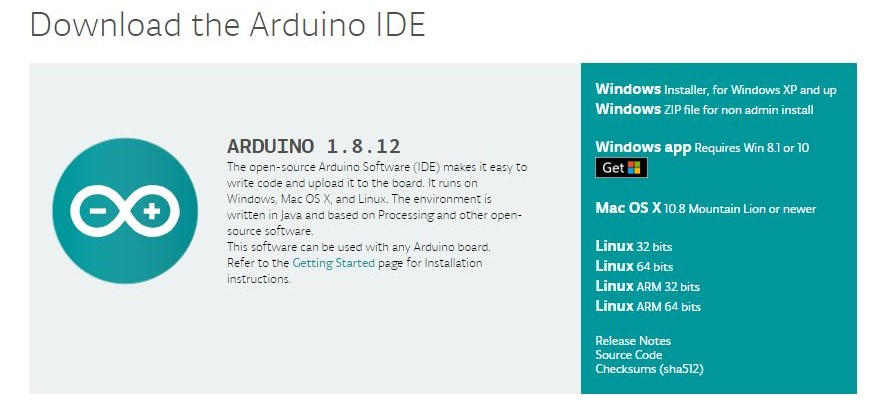
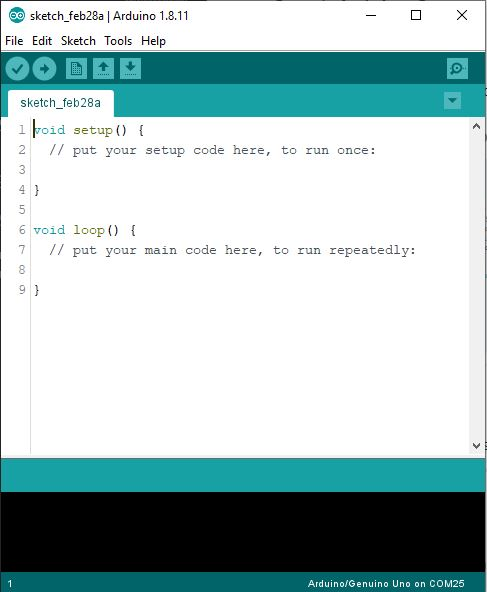

# Control Things Using Mobile

In this workhop we will learn how to control things using a mobile app with arduino and bluetooth module .


### Problem Statement 

We need to get up and walk into the switch board everytime to turn on and off the light or fan etc. 

### Idea

What if, we have a system that can be contol the light and fan using our mobile phone.

### Solution

Build a device that can be controled with mobile app , so we can use the device to trigger the actions on home appliance .


<hr>

### Prototype Building

* Build a device that can be control with Android Application 

Using Arduino and Andoird App we can make the idea into a relaity, since the Arduino can turn on and off using programming also it can be attached with bluetooth module, so we can build a mobile app that can be communicate with arduino.


<hr>


### Things we need

1. Arduino Uno
2. HC-05 Bluetooth Module
3. Led's
3. Jumber Wires
4. Breadboard

<hr>


### Step 1: Arduino Setup

#### 1.1: Install Arduino IDE 

Download the [Arduino IDE](https://www.arduino.cc/en/Main/Software) and install it on your computer.



#### 1.2 walk-through the Arduino Introduction page to learn basics
If you are new to the arduino system, you can learn the [ Arduino basics from here](arduino-intro.md) , after reading then go to the next step. 

### Step 2: Coding

#### 2.1 Open Arduino IDE and Start a new Sketch 



#### 2.2 Copy and Paste the Code

````
char data = 0; //Variable for storing received data

void setup()
{
  Serial.begin(9600);         //Sets the data rate in bits per second (baud) for serial data transmission
  pinMode(13, OUTPUT);        //Sets digital pin 13 as output pin

}
void loop()
{
  if (Serial.available() > 0) // Send data only when you receive data:
  {
    data = Serial.read();      //Read the incoming data and store it into variable data
    if (data == 'A')           //Checks whether value of data is equal to "A"
      digitalWrite(13, HIGH);  //If value is "A" then LED turns ON
    else if (data == 'B')      //Checks whether value of data is equal to "B"
      digitalWrite(13, LOW);   //If value is "B" then LED turns OFF
  }
}
````


