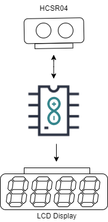
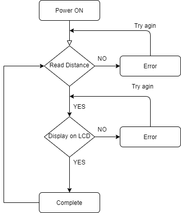
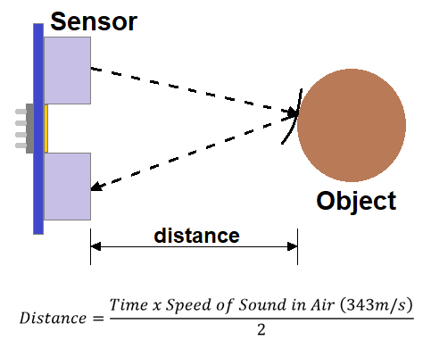
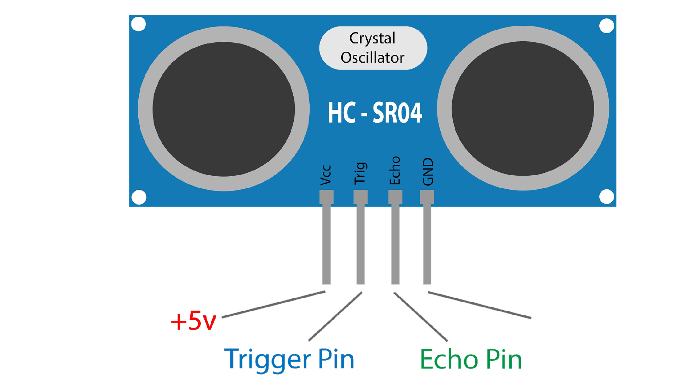

# Digital Scale

In this workhop we will learn how to how to make a digital scale to measure distance.

### Problem Statement 

In order to measure distance from some physical thing we can use scale or measuing tap, but what if we need to need to take continous measurement and analyize the differnce, or we need to make an action depends on the distance like water level, waste level, oil level etc. repetitive continous measurement cost too much human resource. 

### Idea

What if, we have a system that can be continually monitor the level and make actions. 

### Solution

Build a device that can be controled wcontinually monitor the level and make actions like getting notification when a waste bin is full or getting a notification that can be help to prevent flood by monitoring water level..etc

### Prototype Building

* Build a device that Measure distace and displayed on LCD Screen

Here we are using an Arduino as controller and HCSR04 Ultrasonic Module to measure the distance and 16x2 LCD Display to Display the Distance. 

 

### Things we need 

1. Arduino Uno
2. HCSR04 Ultrasonic sensor
3. 16x2 LCD Module
4. Jumper Wires
5. Breadboard

### Step 1: Arduino Setup

#### 1.1: Install Arduino IDE 

Download the [Arduino IDE](https://www.arduino.cc/en/Main/Software) and install it on your computer.

#### 1.2 walk-through the Arduino Introduction page to learn basics
If you are new to the arduino system, you can learn the [ Arduino basics from here](arduino-intro.md) , after reading then go to the next step. 

### Step 2: Coding

#### 2.1 Algorithm

#### Ultrasonic Sensor

Ultrasonic sensors work by sending out a sound wave at a frequency above the range of human hearing.  The transducer of the sensor acts as a microphone to receive and send the ultrasonic sound. 

It emits an ultrasound at 40 000 Hz which travels through the air and if there is an object or obstacle on its path It will bounce back to the module. Considering the travel time and the speed of the sound you can calculate the distance.

The HC-SR04 Ultrasonic Module has 4 pins, Ground, VCC, Trig and Echo. The Ground and the VCC pins of the module needs to be connected to the Ground and the 5 volts pins on the Arduino Board respectively and the trig and echo pins to any Digital I/O pin on the Arduino Board.

#### LCD Module

<!-- #### 2.2 Open Arduino IDE and Start a new Sketch 

#### 2.3 Copy and Paste the Code
 -->
