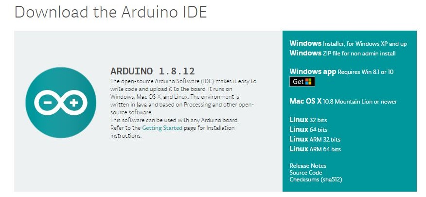

# Digital Thermostat

In this workhop we will learn how to how to make a digital thermostat to measure and display temprature and Humidity. 

### Problem Statement 

In order to measure temprature and Humidity we using online service , but the probel is that, they are getting the data not your place where you searched so value might have difference, we don't know about that. also we can't make action like turing on A/C when temperature is High/Low like that  using data from online services, for this we need absoulte data.
### Idea

What if, we have a system that can be continually monitor and display temprature and Humidity, that can also be used for trigger some actions.

### Solution

Build a device that can be controled continually monitor the temprature and Humidity and make actions like getting notification ike turing on A/C when temperature is High/Low, notification that can be help to refrigerate our food...etc.

### Prototype Building

Build a device that can be display temprature and Humidity also can be make action depends on the temprature and Humidity .

### Things we need

* Arduino Uno
* DHT11- Digital Humidty and Temperature Sensor
* Jumber Wires
* Breadboard

### DHT11

The DHT11 is a basic, ultra low-cost digital temperature and humidity sensor. It uses a capacitive humidity sensor and a thermistor to measure the surrounding air, and spits out a digital signal on the data pin (no analog input pins needed). Its fairly simple to use, but requires careful timing to grab data. The only real downside of this sensor is you can only get new data from it once every 2 seconds, so when using our library, sensor readings can be up to 2 seconds old.

#### LCD Module
An LCD is an electronic display module which uses liquid crystal to produce a visible image. The 16×2 LCD display is a very basic module commonly used in DIYs and circuits. The 16×2 translates o a display 16 characters per line in 2 such lines. In this LCD each character is displayed in a 5×7 pixel matrix.

#### Pin Description 

### Step 1: Arduino Setup

#### 1.1: Install Arduino IDE

Download the [Arduino IDE](https://www.arduino.cc/en/Main/Software) and install it on your computer.

#### 1.2 walk-through the Arduino Introduction page to learn basics
If you are new to the arduino system, you can learn the [ Arduino basics from here](arduino-intro.md) , after reading then go to the next step. 

### Step 2: Programming

#### 2.1 Algorithm

